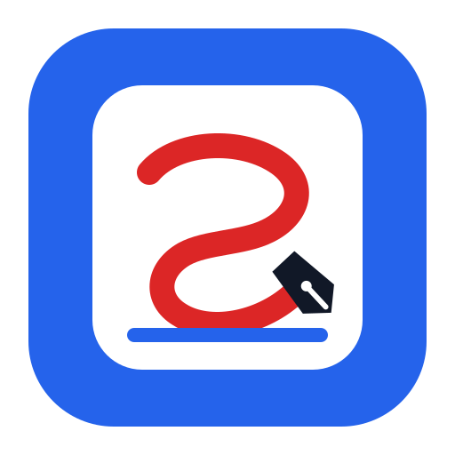

<p align="center">
  
</p>

<h1 align="center">Steady Ink</h1>

<p align="center">
  A Windows screen annotation tool for classroom teaching
</p>

<p align="center">
  
  
  
  <a href="./LICENSE"></a>
</p>

[中文](./README.md)

> [!WARNING]
> Steady Ink is currently in early development. Its main features can already run in a desktop app, but long-term stability and performance still need validation on target 4K touchscreen classroom devices.

## Overview

Steady Ink is designed primarily for Windows 4K touchscreen teaching devices. Its core goals are:

- A floating toolbar and annotation layer that remain above courseware while minimizing obstruction.
- Finger and stylus writing, area erasing, clear, and undo.
- Stylus-priority palm rejection, plus a palm eraser when no stylus is active.
- Reliable PowerPoint/WPS presentation detection, with ink kept by slide for the current presentation.
- Low latency on common Intel integrated GPUs, with no continuous redrawing while idle.

## Current Status

The repository now contains a runnable Windows prototype. Standard annotation, settings, Windows touch input, and PowerPoint presentation integration all run through the same application. The complete first release still requires validation on target hardware and in more Office/WPS environments.

| Area | Status |
| --- | --- |
| Transparent always-on-top window and GPU composition (DirectComposition/D3D12) | Implemented and validated with a basic 1080p run on Intel UHD Graphics 630 |
| Concurrent ink and UI rendering (Skia/egui) | Implemented; target 4K touchscreen hardware still needs validation |
| Standard annotation, color/width selection, area eraser, undo, and clear | Implemented |
| Floating toolbar, quick settings, full settings, and local settings storage | Implemented |
| Windows touch input, palm rejection, and dynamic palm eraser | Integrated with logic tests; parameters still need adjustment on target touchscreen hardware |
| PowerPoint presentation detection, control, and connection recovery | Integrated with a basic two-slide presentation validation |
| WPS presentation integration | Initial integration and diagnostics are complete; validation still needs a supported WPS environment |
| Presentation toolbar, navigation on both sides, collapse animation, and per-slide ink | Implemented |
| Low-power waiting, performance metrics, and GPU diagnostics | Implemented |

## Current Interface Behavior

- The idle floating toolbar and the standard annotation toolbar can both be dragged and snapped to the left or right edge of the screen. Snapping changes only the horizontal coordinate and preserves the constrained vertical coordinate.
- In standard annotation mode, color and pen-width pickers use a vertical layout. They expand left when the toolbar is on the right, and right when it is on the left, avoiding overlap.
- Available colors are red, yellow, blue, green, black, and white. Pen widths are fixed at 4pt, 8pt, 16pt, and 24pt; the default is 4pt.
- In PowerPoint/WPS presentation mode, the central toolbar touches the bottom edge. Navigation controls are anchored to the lower-left and lower-right corners without extra safe margins.
- The interface uses 80% of the original design scale. Icon-and-label buttons use 51.2 egui points. Panels, buttons, popups, and borders use 50% opacity, while text, icons, swatches, and ink remain fully opaque.
- The settings view can change default tools, enable or disable PowerPoint/WPS integration, show graphics and presentation-connection diagnostics, and exit the application normally.

## Technical Implementation

Steady Ink is built with Rust. Its code is organized by responsibility, including windows, UI, ink, input, and PowerPoint/WPS integration, to keep the project maintainable.

```text
winit event loop
└─ DirectComposition / DXGI / D3D12
   └─ rust-skia GPU drawing layer
      ├─ persistent ink layer
      └─ egui + egui-winit UI rendering

Windows touch input ──> input routing ──> ink document
PowerPoint / WPS integration ───> slideshow state ──> per-slide ink store
```

Key technology choices:

- `winit`: window management and an event loop that waits when idle.
- DirectComposition / DXGI / D3D12: Windows transparent-window and GPU composition support.
- `rust-skia`: GPU ink rendering, UI mesh rendering, and window composition.
- `egui` and `egui-winit`: touch-friendly toolbars, layout, and input integration.
- `windows`: Windows touch input, Office integration through COM, and system capabilities such as `SendInput`.

The transparent rendering path does not depend on a standard WGL default framebuffer, `WS_EX_LAYERED` color keys, or full-screen CPU bitmap uploads. The current backend uses `DXGI_FORMAT_B8G8R8A8_UNORM`, flip sequential, and `DXGI_ALPHA_MODE_PREMULTIPLIED` to avoid a transparent WGL full-screen window being composed as black by DWM on Intel integrated graphics.

## Requirements

- 64-bit Windows 10 or Windows 11.
- Rust 1.92 or later with the MSVC toolchain.
- Visual Studio Build Tools 2022 with the "Desktop development with C++" workload installed.
- A GPU and driver supporting Direct3D 12 and DirectComposition. WARP software rendering is suitable only for functional testing, not performance results.
- PowerPoint or a WPS Presentation edition that supports automation, only when testing presentation integration.

Windows is currently the only supported platform. macOS and Linux are not supported.

## Run from Source

Run the following in PowerShell 7:

```powershell
git clone https://github.com/Enigfrank/Steady-Ink.git
Set-Location Steady-Ink
cargo run --release
```

The first build downloads Rust dependencies. Building `skia-safe` usually takes longer than a typical Rust dependency.

For more detailed runtime logs:

```powershell
$env:RUST_LOG = "debug"
cargo run
```

To collect frame time, input-to-display latency, redraw reasons, and full-canvas rebuild counts:

```powershell
$env:STEADY_INK_METRICS = "1"
cargo run --release
```

Performance metrics are disabled by default. When enabled, they print a report every five seconds without triggering continuous redrawing.

## Development and Checks

Before submitting changes, run:

```powershell
cargo fmt --check
cargo check
cargo test
cargo clippy --all-targets -- -D warnings
```

The current automated suite contains 42 logic and layout tests. It covers state transitions, clear-and-undo, per-slide ink, palm classification, presentation-connection recovery, picker directions, edge snapping, and presentation-toolbar positioning.

The project is organized by feature:

```text
src/
├─ app/         # Application assembly and top-level state management
├─ window/      # Transparent windows, DirectComposition/D3D12, and screen geometry
├─ render/      # Skia and egui composition
├─ ui/          # Design tokens and toolbars
├─ ink/         # Ink data, undo, per-slide storage, and GPU cache
├─ input/       # Mouse, touch, Windows touch input, and palm recognition
├─ slideshow/   # PowerPoint/WPS presentation detection and session management
└─ settings/    # User settings and local TOML storage
```

## Roadmap

- [x] Rust project skeleton and feature-based modules.
- [x] DirectComposition transparent swap chain, Skia ink, and egui composition prototype.
- [x] Standard annotation interaction, tool selection, and an undoable ink model.
- [x] Settings, quick settings, local settings storage, and normal application exit.
- [x] Windows touch input, palm rejection, and the dynamic palm-eraser path.
- [x] PowerPoint/WPS presentation integration, page controls, and the connection-loss interface.
- [x] Presentation state management, per-slide ink, a bottom toolbar, and navigation controls on both sides.
- [ ] Validate palm-recognition thresholds and stylus hover on target touchscreen hardware.
- [ ] Validate real WPS presentation events, control, and reconnection compatibility.
- [ ] Validate 4K touchscreen performance on Intel integrated graphics.
- [ ] Windows installer, release process, and upgrade notes.

## Not Included in the First Release

The first release does not include:

- macOS, Linux, mobile platforms, or multi-monitor support.
- Cloud synchronization, accounts, collaboration, or online services.
- Screenshot saving, ink-file saving, or writing ink back to PowerPoint/WPS files.
- Whiteboards, shape recognition, complex gestures, custom color palettes, or a theme system.
- Guessing presentation state from a window title, process name, or foreground window when the presentation connection is unavailable.

## Data and Privacy

- Ink is kept only while the application is open. It is not written into courseware or local ink files.
- User settings are stored at `%APPDATA%\Steady-Ink\settings.toml` and contain only default tools and the presentation-integration setting.
- The project uses no cloud services and includes no telemetry or account system.

## Contributing

Bug reports and code improvement suggestions are welcome. For larger feature or architecture changes, please start a discussion describing the teaching scenario, expected behavior, and validation approach, so the work remains within the first-release scope.

When submitting code:

- Keep changes focused and follow the existing small, feature-based file structure.
- Add concise function-level comments to new functions.
- Add pure logic tests for state management, ink behavior, and data boundaries.
- For changes involving touch, display scaling, GPU rendering, or PowerPoint/WPS integration, document the test environment and anything that still requires hardware validation.
- Ensure formatting, compilation, tests, and Clippy checks pass.

When reporting a touch, rendering, or presentation-integration issue, include the Windows version, display scaling, device model, GPU model and driver information, PowerPoint/WPS version, and reproduction steps.

## License

Steady Ink and this project's original icon are released under the [GNU General Public License v3.0 or later](./LICENSE).
